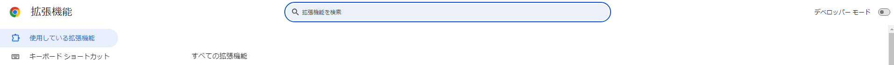
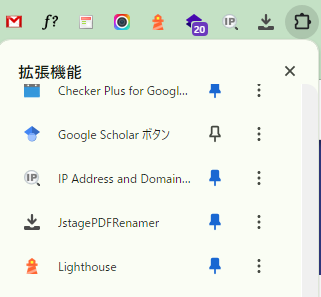

# JstagePDFRenamer

J-STAGEでPDFを「著者名（刊行年）タイトル」という名前でダウンロードします。

Google Chrome ブラウザ用の拡張機能です。

> [!IMPORTANT]
> ウェブストアで公開するにはお金がかかるのでデベロッパーモードで読み込んで利用してください。
> 
> 利用者が増えるのであればウェブストアで公開します。

## 使用方法

`Google Chrome`での利用を想定しています。

> [!NOTE]
> `Microsoft Edge`でも利用できました。（以下の説明は`Google Chrome`における説明であり，`Microsoft Edge`の場合は適宜読み替えてください。）

### 0. スクリプトのダウンロード

[https://github.com/ikepu-tp/JstagePdfRenamer](https://github.com/ikepu-tp/JstagePdfRenamer)を開き，右上の「Code > Download ZIP」からスクリプトをダウンロードし，解凍してください。

### 1. 拡張機能管理画面

[chrome://extensions/](chrome://extensions/)を開いてください。

### 2. デベロッパーモードの有効

右上の「デベロッパーモード」を有効にしてください。

### 3. パッケージ読み込み

デベロッパーモードを有効にしたら，左上に「パッケージ化されていない拡張機能を読み込む」を開いてください。

### 4. フォルダの選択

0.でダウンロードしたスクリプトのフォルダを選択してください。

### 5. PDFのダウンロード

J-STAGEの任意のページ（e.g., [https://www.jstage.jst.go.jp/article/pamjaep/65/0/65_178/_article/-char/ja](https://www.jstage.jst.go.jp/article/pamjaep/65/0/65_178/_article/-char/ja)）を開き，「JstagePDFRenamer」をクリックしてください。
「著者名（刊行年）タイトル」でダウンロードが実行されます。

