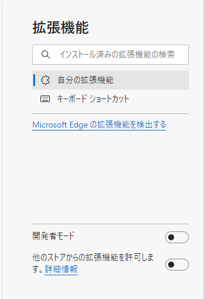

# JstagePDFRenamer

J-STAGEでPDFを「著者名（刊行年）タイトル」という名前でダウンロードします。

Google Chrome ブラウザ用の拡張機能です。

> [!IMPORTANT]
> 現在，[Chromeウェブストア](https://chromewebstore.google.com/detail/jstagepdfrenamer/kapjcljkkbmanamjpmljojjekhpnhidg?hl=ja)で公開されています。
> `Google Chrome`と`Microsoft Edge`，`Brave`は拡張機能を追加して利用できます。

## 使用方法

### Google Chrome，Brave

#### 1. 拡張機能の追加

[Chromeウェブストア](https://chromewebstore.google.com/detail/jstagepdfrenamer/kapjcljkkbmanamjpmljojjekhpnhidg?hl=ja)にアクセスし，拡張機能を追加します。

### Microsoft Edge

#### 1. 下準備

[edge://extensions/](edge://extensions/)（拡張機能管理画面）を開きます。

#### 2. 拡張機能の許可

左下にある「他のストアからの拡張機能を許可します。」を有効にします。

#### 3. 拡張機能の追加

[Chromeウェブストア](https://chromewebstore.google.com/detail/jstagepdfrenamer/kapjcljkkbmanamjpmljojjekhpnhidg?hl=ja)にアクセスし，拡張機能を追加します。

### PDFのダウンロード

J-STAGEの任意のページ（e.g., [https://www.jstage.jst.go.jp/article/pamjaep/65/0/65_178/_article/-char/ja](https://www.jstage.jst.go.jp/article/pamjaep/65/0/65_178/_article/-char/ja)）を開き，ツールバーにある拡張機能のアイコンをクリックしてください。

## バグ・機能改修

バグや機能改修のリクエストは以下のいずれかの方法でお知らせください。

- [Issues](https://github.com/ikepu-tp/JstagePdfRenamer/issues)
- [Pull Requests](https://github.com/ikepu-tp/JstagePdfRenamer/pulls)
- [X](https://x.com/ikepu_tp)
- [Form](https://forms.office.com/r/SkFsGSGTyQ)

## ライセンス

著作権を放棄していません。
無許可での複製・再配布，改変は禁止します。
個人での利用においても，原則改変をしないでください。
改変を行う場合は，Forkし，Pull Requestを送信してください。

## 更新履歴

### v0.3.0 (2024.02.12)

ページ上に要素を追加しました。
これにより，ファイル名の編集が可能になったほか，ダウンロードが分かりやすくなりました。

### v0.2.0 (2024.01.31)

ウェブストアで公開しました。
